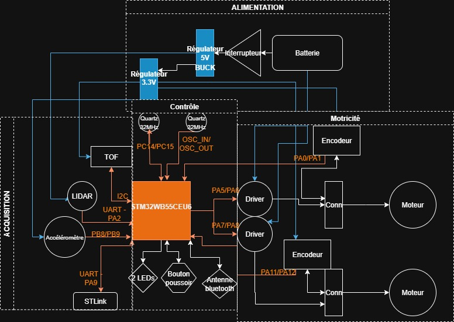

# Projet Robot Chat

**ESE – Projet de groupe**

Ce projet consiste à concevoir et réaliser un **robot mobile à deux roues motrices** capable de participer à un jeu de **chat et souris** contre les robots de nos camarades.

---

## Objectifs fonctionnels

Pour atteindre ce comportement, plusieurs fonctions clés doivent être mises en place :

1. **Déplacement**

   * Roues + moteurs motoréducteurs
   * Drivers de moteurs (PWM via timers)
   * Encodeurs (lecture via timers)

2. **Anti-chute**

   * Détection des bords avec capteur **ToF** (I²C)

3. **Détection des adversaires**

   * Capteur **LIDAR** pour repérer d’autres robots

4. **Détection de collisions**

   * Échange de rôles lors d’un choc (capteur **accéléromètre**)

5. **Communication**

   * Liaison **Bluetooth** avec le PC (STM32WB55CEU6)

6. **Alimentation**

   * Batterie et gestion d’énergie (7.2 V → régulateurs 5 V & 3.3 V)

---

## Composants principaux

* **Microcontrôleur** : STM32WB55CEU6 (ARM Cortex-M4, BLE intégré)
* **Quartz** : 16 MHz (Farnell : 2853935)
* **Connecteur SWD/STLink** : (Farnell : 3226055)
* **Moteurs** : DFRobot FIT0520 ou FIT0521
* **Alimentation** : Batterie NiMH 7.2 V 1.3 Ah (RS : 777-0377)

  * Régulateur 5 V : MP1475DJ-LF-P
  * Régulateur 3.3 V : BU33SD5WG-TR
* **Drivers moteurs** : ZXBM5210 (un par roue)
* **Capteurs** :

  * LIDAR YDLIDAR X2
  * Accéléromètre ADXL343BCCZ-RL
  * Capteur ToF anti-chute
* **Connecteurs** : JST 2.54 mm
* **Interface utilisateur** :

  * LED rouge/verte
  * Boutons poussoirs Wurth 430182070816 (6×6 mm, H9.5 mm)
  * Interrupteur ON/OFF Wurth 472121020311

---

## Conception à réaliser

1. **Électronique**

   * Schéma électrique et PCB personnalisé
   * Routage, fabrication et soudure des composants

2. **Mécanique**

   * Conception du châssis sur **Onshape**
   * Intégration du PCB, moteurs, capteurs et batterie

3. **Logiciel embarqué**

   * Programmation STM32 (CubeIDE)
   * Gestion des rôles (chat/souris)
   * Contrôle moteurs, capteurs et communication Bluetooth

## Architecture générale 

## Avancement du projet

* [x] Choix des composants et architecture générale
* [x] Schéma et routage PCB
* [x] Impression 3D du robot
* [ ] Développement logiciel de base
* [ ] Intégration LIDAR et logique “chat/souris”
* [ ] Tests finaux et matchs entre robots 🎮

